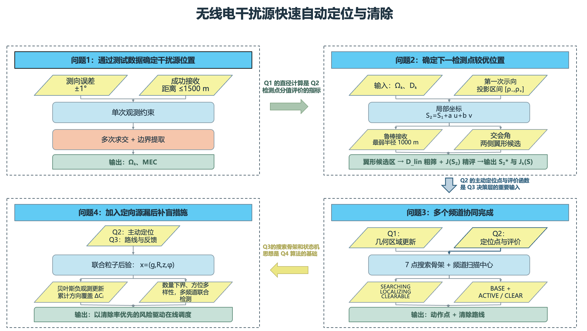

# 无线电干扰源的快速自动定位与清除

> 2026 年全国大学生数学建模竞赛项目

本项目面向复杂环境中的无线电干扰源自动排查任务，设计了一套由机器狗执行的搜索、定位与清除方法。模型将有界测向误差、未知接收半径、定向信号盲区，以及移动和操作时间成本统一纳入建模与决策过程。

## 问题与方法

1. **多检测点交会定位**：方向扇形约束、可行域直径与最小外接圆。
2. **第二检测点的鲁棒选择**：综合最小接收半径与最坏交会角，最小化最坏定位直径。
3. **全向干扰源的在线搜索与清除**：七点覆盖骨架、频道状态更新与滚动路径规划。
4. **混合干扰源的盲区补偿**：粒子后验、多频道联合价值函数与动态补盲。



## 主要结果

- 目标区域半径 1800 m，测向误差不超过 ±1°。
- 问题三三次正式测试分别清除 12、10、12 个干扰源；平均定位清除时间为 345.60 s、437.30 s、328.44 s。
- 问题四三次正式测试分别清除 10、14、10 个干扰源；平均定位清除时间为 589.43 s、265.81 s、362.81 s。

## 仓库结构

```text
.
├── paper/       # 完整论文
├── src/         # 四问求解代码与可视化脚本
├── figures/     # 论文与结果图
├── docs/        # 补充证明材料
├── requirements.txt
└── README.md
```

## 快速开始

建议使用 Python 3.10 或更高版本：

```bash
python -m venv .venv
source .venv/bin/activate
pip install -r requirements.txt
cd src
python problem1_visualize.py
python problem2.py
```

问题 3、4 的在线控制程序需要配合竞赛提供的本地模拟器；默认接口地址为 `http://127.0.0.1:2026`。

## 说明

本仓库保留可复现模型代码、论文、证明材料和图表。正式运行日志未公开：其含有竞赛平台签发的加密票据与队伍标识，不适合上传至公开仓库。
